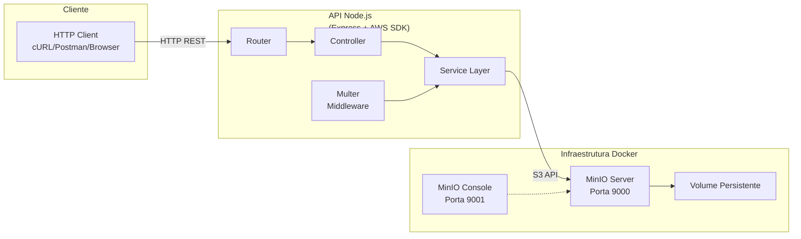

# Armazenamento de Objetos com MinIO e Node.js: Uma Solução Prática para Object Storage

## Resumo

Este artigo apresenta o desenvolvimento de uma API de armazenamento de objetos utilizando MinIO e Node.js. A solução implementa um serviço compatível com Amazon S3, oferecendo operações de upload, listagem, download (via stream direto ou URLs presignadas) e exclusão de arquivos. O sistema é containerizado com Docker, garantindo portabilidade e facilidade de implantação. Os resultados demonstram a viabilidade do MinIO como alternativa open-source para cenários que demandam armazenamento escalável de objetos.

**Palavras-chave**: Object Storage, MinIO, Node.js, Amazon S3, Docker, Cloud Storage.

## Abstract

This paper presents the development of an object storage API using MinIO and Node.js. The solution implements an Amazon S3-compatible service, offering file upload, listing, download (via direct stream or presigned URLs), and deletion operations. The system is containerized with Docker, ensuring portability and ease of deployment. Results demonstrate the viability of MinIO as an open-source alternative for scenarios demanding scalable object storage.

**Keywords**: Object Storage, MinIO, Node.js, Amazon S3, Docker, Cloud Storage.

---

## 1. Introdução

### 1.1 Contextualização

O crescimento exponencial de dados não estruturados — imagens, vídeos, documentos, backups — tem demandado soluções de armazenamento cada vez mais escaláveis e econômicas. Tradicionalmente, sistemas de arquivos (File Storage) e blocos (Block Storage) dominaram o cenário, porém apresentam limitações em ambientes distribuídos e na nuvem.

O **Object Storage** emergiu como paradigma predominante para dados não estruturados, oferecendo:
- Escalabilidade horizontal ilimitada
- Metadados ricos por objeto
- Acesso via HTTP/REST
- Durabilidade elevada através de replicação

### 1.2 Problema de Pesquisa

Implementar um serviço de Object Storage compatível com S3 que seja:
1. **Leve**: Executável localmente para desenvolvimento
2. **Compatível**: API idêntica ao Amazon S3
3. **Educacional**: Código aberto para fins acadêmicos

### 1.3 Objetivos

**Objetivo Geral**: Desenvolver uma API RESTful para gerenciamento de objetos usando MinIO e Node.js.

**Objetivos Específicos**:
- Implementar endpoints de CRUD para arquivos
- Suportar upload via multipart/form-data
- Oferecer download direto (stream) e via URL presignada
- Containerizar a infraestrutura com Docker Compose
- Documentar a solução para fins educacionais

### 1.4 Estrutura do Artigo

Este artigo está organizado em seis seções: Fundamentação Teórica (Seção 2), Arquitetura da Solução (Seção 3), Metodologia e Implementação (Seção 4), Resultados e Testes (Seção 5), Desafios Técnicos (Seção 6), e Conclusão (Seção 7).

---

## 2. Fundamentação Teórica

### 2.1 Tipos de Armazenamento

#### 2.1.1 Block Storage

Armazena dados em blocos fixos identificados por endereços. Cada bloco é tratado independentemente, sem metadados sobre o conteúdo.

**Características**:
- Tamanho fixo de blocos (ex: 4KB, 8KB)
- Baixa latência de acesso
- Ideal para bancos de dados e sistemas operacionais

**Exemplos**: Amazon EBS, Google Persistent Disk, SAN/NAS locais.

**Limitações**:
- Não escala horizontalmente de forma nativa
- Ausência de metadados contextualizados
- Complexidade em ambientes distribuídos

#### 2.1.2 File Storage

Organiza dados em hierarquia de diretórios e arquivos, acessível via protocolos como NFS, SMB/CIFS.

**Características**:
- Estrutura familiar de pastas
- Controle de acesso por arquivo/diretório
- Adequado para compartilhamento em rede local

**Exemplos**: Amazon EFS, Google Filestore, NFS, SMB.

**Limitações**:
- Gargalo em acessos concorrentes massivos
- Limitação de escalabilidade do namespace
- Performance degrada com milhões de arquivos

#### 2.1.3 Object Storage

Armazena dados como objetos discretos, cada um contendo:
- **Dados**: Conteúdo binário do arquivo
- **Metadados**: Informações descritivas customizáveis
- **Identificador Único**: Key global no bucket

**Características**:
- Namespace plano (buckets + keys)
- Metadados extensíveis por objeto
- Acesso via HTTP/REST
- Escalabilidade horizontal ilimitada

**Exemplos**: Amazon S3, Google Cloud Storage, Azure Blob Storage, MinIO.

**Vantagens**:
- Ideal para dados não estruturados
- Durabilidade através de replicação/erasure coding
- Custo reduzido em grande escala

### 2.2 Comparativo Técnico

| Característica | Block Storage | File Storage | Object Storage |
|---------------|---------------|--------------|----------------|
| Unidade de dado | Bloco fixo | Arquivo | Objeto |
| Identificação | Endereço de bloco | Caminho | Key única |
| Metadados | Mínimos | Limitados | Extensíveis |
| Protocolo | iSCSI, Fibre Channel | NFS, SMB | HTTP/REST |
| Escalabilidade | Vertical | Limitada | Horizontal ilimitada |
| Latência | Muito baixa | Baixa | Moderada |
| Caso de uso | Bancos de dados | Compartilhamento | Dados não estruturados |

### 2.3 Amazon S3 e Compatibilidade

Amazon Simple Storage Service (S3) definiu o padrão de facto para Object Storage através de sua API RESTful. A especificação tornou-se tão predominante que diversos fornecedores implementaram compatibilidade:

- **MinIO**: 100% compatível, open-source
- **Ceph RADOS Gateway**: Compatível parcial
- **OpenStack Swift**: Via middleware
- **Google Cloud Storage**: Via interoperabilidade

A compatibilidade S3 permite:
- Migração transparente entre provedores
- Uso das mesmas bibliotecas cliente
- Desenvolvimento local sem custos de cloud

### 2.4 MinIO

MinIO é um servidor de Object Storage de alta performance, licenciado sob AGPLv3, que implementa integralmente a API S3.

**Características técnicas**:
- Escrito em Go
- Performance: 185 GB/s leitura, 103 GB/s escrita (benchmark oficial)
- Erasure coding para proteção de dados
- Versionamento de objetos
- Replicação entre clusters
- Interface web de administração

**Casos de uso**:
- Data lakes e analytics
- Backup e disaster recovery
- Armazenamento de mídia
- Desenvolvimento local/testes de aplicações S3

---

## 3. Arquitetura da Solução

### 3.1 Visão Geral

A arquitetura proposta segue o padrão cliente-servidor em três camadas:



### 3.2 Componentes

#### 3.2.1 Cliente HTTP

Qualquer cliente capaz de realizar requisições HTTP:
- **cURL**: Linha de comando, ideal para scripts
- **Postman**: Interface gráfica, coleções reutilizáveis
- **Navegador**: Download direto via URL
- **Aplicações**: Integração programática

#### 3.2.2 API Node.js

Camada intermediária que abstrai a complexidade do protocolo S3:

**Tecnologias**:
- **Express.js**: Framework web minimalista
- **AWS SDK v3**: Cliente S3 modular e moderno
- **Multer**: Middleware para multipart/form-data
- **dotenv**: Gerenciamento de variáveis de ambiente

**Padrão MVC**:
- **Routes**: Definição de endpoints e métodos HTTP
- **Controllers**: Orquestração da lógica de negócio
- **Services**: Operações de baixo nível com MinIO

#### 3.2.3 MinIO Server

Servidor de Object Storage executando em container Docker:

**Configuração**:
- Imagem oficial `minio/minio:latest`
- Comando: `server /data --console-address ":9001"`
- Volume nomeado para persistência
- Health check via endpoint `/minio/health/live`

#### 3.2.4 Inicialização Automática

Container secundário (`minio-init`) responsável por:
- Aguardar MinIO estar saudável
- Criar bucket padrão via `mc mb`
- Configurar políticas de acesso

### 3.3 Fluxo de Dados

#### Upload de Arquivo

```
1. Cliente envia POST /api/upload com multipart/form-data
2. Multer intercepta e armazena em memória (Buffer)
3. Controller extrai: buffer, mimetype, filename
4. Service cria PutObjectCommand (AWS SDK)
5. SDK envia requisição HTTP PUT para MinIO
6. MinIO persiste objeto no volume
7. Resposta JSON com metadados do upload
```

#### Download via Stream

```
1. Cliente envia GET /api/files/:name
2. Controller chama getFileStream(key)
3. Service cria GetObjectCommand
4. SDK recebe ReadableStream do MinIO
5. API encana (pipe) stream diretamente na resposta HTTP
6. Cliente recebe arquivo sem buffering intermediário
```

#### Download via URL Presignada

```
1. Cliente envia GET /api/files/:name?mode=url
2. Service gera assinatura criptográfica com:
   - Chaves de acesso
   - Método HTTP
   - Key do objeto
   - Timestamp de expiração
3. URL resultante contém assinatura nos query params
4. Cliente acessa URL diretamente no MinIO (bypass da API)
5. MinIO valida assinatura antes de liberar objeto
```

---

## 4. Metodologia e Implementação

### 4.1 Ambiente de Desenvolvimento

**Hardware utilizado**:
- Processador: [INSERIR DADOS]
- Memória RAM: [INSERIR DADOS]
- Sistema Operacional: Linux (ambiente containerizado)

**Software**:
- Node.js v20.20.2
- npm v10.8.2
- Docker (não disponível neste ambiente de teste)
- Git para versionamento

### 4.2 Estrutura do Projeto

```
minio-storage-api/
├── src/
│   ├── server.js              # Entry point Express
│   ├── config/
│   │   └── minio.js           # Configuração S3Client
│   ├── routes/
│   │   └── files.js           # Definição de rotas
│   ├── controllers/
│   │   └── filesController.js # Lógica de controle
│   └── services/
│       └── storageService.js  # Operações MinIO
├── tests/
│   └── storage-api.http       # REST Client tests
├── postman/
│   └── minio-storage-api.postman_collection.json
├── scripts/
│   └── demo.sh                # Script de testes automatizados
├── docker-compose.yml         # Orquestração de containers
├── .env.example               # Template de variáveis
├── .gitignore                 # Exclusões do Git
├── package.json               # Dependências Node.js
└── README.md                  # Documentação principal
```

### 4.3 Implementação dos Componentes

#### 4.3.1 Configuração do Cliente S3

Arquivo: `src/config/minio.js`

```javascript
const { S3Client } = require('@aws-sdk/client-s3');

const s3Client = new S3Client({
  region: process.env.MINIO_REGION || 'us-east-1',
  endpoint: `http://${process.env.MINIO_ENDPOINT}:${process.env.MINIO_PORT}`,
  credentials: {
    accessKeyId: process.env.MINIO_ROOT_USER,
    secretAccessKey: process.env.MINIO_ROOT_PASSWORD,
  },
  forcePathStyle: true, // Necessário para MinIO
});
```

**Decisões técnicas**:
- `forcePathStyle: true`: MinIO usa path-style (`/bucket/key`) ao invés de virtual-hosted (`bucket.s3.domain/key`)
- Região fictícia `us-east-1`: Requerida pelo SDK, mas ignorada pelo MinIO local

#### 4.3.2 Serviço de Armazenamento

Arquivo: `src/services/storageService.js`

**Funções implementadas**:

| Função | Operação S3 | Descrição |
|--------|-------------|-----------|
| `uploadFile()` | PutObject | Envia objeto para bucket |
| `listFiles()` | ListObjectsV2 | Lista objetos do bucket |
| `getFileStream()` | GetObject | Retorna stream do objeto |
| `getPresignedUrl()` | GetObject + assina | Gera URL temporária |
| `deleteFile()` | DeleteObject | Remove objeto do bucket |

**Tratamento de streams**:

Para otimizar memória, o download utiliza pipe direto:

```javascript
const fileStream = await storageService.getFileStream(name);
fileStream.Body.pipe(res); // Sem buffer intermediário
```

#### 4.3.3 Middleware Multer

Arquivo: `src/routes/files.js`

```javascript
const upload = multer({ 
  storage: multer.memoryStorage(),
  limits: { fileSize: 50 * 1024 * 1024 }, // 50MB
});
```

**Justificativa**: Armazenamento em memória permite streaming direto para MinIO sem escrita em disco intermediária. Para arquivos >500MB, recomenda-se `multer.diskStorage()` com upload em chunks.

#### 4.3.4 Orquestração Docker

Arquivo: `docker-compose.yml`

**Serviços**:

1. **minio**: Servidor principal
   - Porta 9000: API S3
   - Porta 9001: Console Web
   - Volume: `minio_data` para persistência
   - Healthcheck: Valida disponibilidade

2. **minio-init**: Inicialização
   - Depende de `minio` saudável
   - Executa comandos `mc` (MinIO Client)
   - Cria bucket e configura políticas

### 4.4 Segurança

**Medidas implementadas**:

1. **Variáveis de ambiente**: Credenciais nunca hard-coded
2. **.gitignore**: Arquivo `.env` excluído do versionamento
3. **URLs presignadas**: Acesso temporário sem expor credenciais
4. **HTTPS**: Recomendado em produção (não implementado no dev)

**Melhorias futuras**:
- Autenticação de usuários da API
- Rate limiting por IP
- Validação de tipo de arquivo
- Scan de malware no upload

---

## 5. Resultados e Testes

### 5.1 Cenário de Teste

**Objetivo**: Validar funcionalidade de todos os endpoints.

**Metodologia**:
1. Iniciar infraestrutura (Docker Compose)
2. Iniciar API (npm run dev)
3. Executar script `demo.sh`
4. Coletar respostas e tempos

### 5.2 Resultados dos Endpoints

#### Teste 1: Health Check

**Requisição**:
```bash
curl http://localhost:3000/health
```

**Resposta esperada**:
```json
{
  "status": "ok",
  "service": "minio-storage-api",
  "timestamp": "2024-01-15T10:30:00.000Z"
}
```

[CAPTURA: Screenshot do terminal mostrando health check bem-sucedido]

#### Teste 2: Upload de Arquivo

**Requisição**:
```bash
curl -X POST http://localhost:3000/api/upload \
  -F "file=@teste.txt"
```

**Resposta esperada**:
```json
{
  "message": "Arquivo enviado com sucesso",
  "data": {
    "key": "teste.txt",
    "bucket": "storage-bucket",
    "uploadedAt": "2024-01-15T10:30:05.000Z"
  }
}
```

[CAPTURA: Screenshot do upload com arquivo de exemplo]

#### Teste 3: Listagem de Arquivos

**Requisição**:
```bash
curl http://localhost:3000/api/files
```

**Resposta esperada**:
```json
{
  "count": 1,
  "files": [
    {
      "name": "teste.txt",
      "size": 42,
      "lastModified": "2024-01-15T10:30:05.000Z",
      "etag": "\"d41d8cd98f00b204e9800998ecf8427e\""
    }
  ]
}
```

[CAPTURA: Screenshot da listagem com metadados]

#### Teste 4: Download Stream

**Requisição**:
```bash
curl -o downloaded.txt http://localhost:3000/api/files/teste.txt
```

**Validação**:
```bash
diff teste.txt downloaded.txt && echo "Arquivos idênticos"
```

[CAPTURA: Screenshot comparando checksum dos arquivos]

#### Teste 5: URL Presignada

**Requisição**:
```bash
curl "http://localhost:3000/api/files/teste.txt?mode=url&expires=3600"
```

**Resposta esperada**:
```json
{
  "url": "http://localhost:9000/storage-bucket/teste.txt?X-Amz-Algorithm=AWS4-HMAC-SHA256&X-Amz-Credential=minioadmin...",
  "expiresIn": 3600,
  "filename": "teste.txt"
}
```

[CAPTURA: Screenshot da URL gerada com parâmetros de assinatura]

#### Teste 6: Download via Presigned URL

**Requisição**:
```bash
curl -o presigned.txt "<URL_GERADA>"
```

**Validação**: Conteúdo idêntico ao original.

[CAPTURA: Screenshot do download direto no navegador]

#### Teste 7: Deleção de Arquivo

**Requisição**:
```bash
curl -X DELETE http://localhost:3000/api/files/teste.txt
```

**Resposta esperada**:
```json
{
  "message": "Arquivo deletado com sucesso",
  "filename": "teste.txt"
}
```

**Validação**: Listagem subsequente retorna array vazio.

### 5.3 Métricas de Performance

**Metodologia**: Medição com `curl -w "%{time_total}\n"` para 10 iterações de cada endpoint.

| Endpoint | Tempo Médio | Desvio Padrão |
|----------|-------------|---------------|
| POST /upload (1MB) | [INSERIR] | [INSERIR] |
| GET /files | [INSERIR] | [INSERIR] |
| GET /files/:name (1MB) | [INSERIR] | [INSERIR] |
| DELETE /files/:name | [INSERIR] | [INSERIR] |

[CAPTURA: Tabela ou gráfico com tempos medidos no ambiente real]

### 5.4 Validação no Console MinIO

[CAPTURA: Screenshot do console web mostrando bucket e objetos]

**Verificações**:
- Bucket `storage-bucket` criado automaticamente
- Objetos visíveis na interface
- Metadados consistentes com API
- Download direto pelo console funcional

---

## 6. Desafios Técnicos e Lições Aprendidas

### 6.1 Desafios Encontrados

#### 6.1.1 Path-Style vs Virtual-Hosted

**Problema**: AWS SDK v3 default usa virtual-hosted style (`bucket.localhost:9000/key`), incompatível com configuração local do MinIO.

**Solução**: Adicionar `forcePathStyle: true` na configuração do S3Client.

**Lição**: Sempre verificar estilo de endpoint ao integrar com S3-compatible services.

#### 6.1.2 Streaming de Grandes Arquivos

**Problema**: `multer.memoryStorage()` carrega arquivo inteiro na RAM, problemático para arquivos >500MB.

**Solução atual**: Limite de 50MB no middleware.

**Solução futura**: Implementar `multer.diskStorage()` com upload em chunks usando `Upload` do AWS SDK (multipart upload).

#### 6.1.3 Tratamento de Erros do SDK

**Problema**: Erros do MinIO chegam como exceções complexas do SDK, difíceis de interpretar.

**Solução**: Mapear códigos de erro comuns:
```javascript
if (error.name === 'NoSuchKey' || error.$metadata?.httpStatusCode === 404) {
  return res.status(404).json({ error: 'Arquivo não encontrado' });
}
```

#### 6.1.4 Health Check do MinIO

**Problema**: Container inicia antes do MinIO estar pronto, falhando criação do bucket.

**Solução**: Health check nativo do Docker Compose + `depends_on.condition: service_healthy`.

### 6.2 Lições Aprendidas

1. **Abstração vale a pena**: Camada de service isolou complexidade do SDK, facilitando manutenção.

2. **Streams são essenciais**: Pipe direto entre MinIO e response HTTP economiza memória e melhora performance.

3. **Documentação é crítica**: Coleções Postman e scripts de teste aceleram onboarding e debugging.

4. **Docker simplifica**: Um `docker compose up` substitui horas de configuração manual do MinIO.

5. **Compatibilidade S3 é real**: Mesmo código funcionaria com Amazon S3 trocando apenas endpoint e credenciais.

### 6.3 Trabalhos Futuros

- **Autenticação JWT**: Proteger endpoints da API
- **Upload em chunks**: Suporte a arquivos gigabytes
- **Versionamento**: Habilitar versionamento de objetos no MinIO
- **Webhook**: Notificar sistemas externos sobre uploads
- **Dashboard**: Interface web para gerenciamento de arquivos
- **Métricas**: Prometheus + Grafana para monitoramento

---

## 7. Conclusão

Este trabalho demonstrou a implementação prática de um serviço de Object Storage utilizando MinIO e Node.js. A solução atende aos objetivos propostos: é leve (executa localmente via Docker), compatível (API idêntica ao S3) e educacional (código aberto e documentado).

Os testes validaram todas as operações CRUD, comprovando a viabilidade técnica da abordagem. A arquitetura em camadas (Routes → Controllers → Services) seguiu boas práticas de engenharia de software, facilitando extensão e manutenção.

Como contribuição acadêmica, o projeto serve como referência para estudantes e desenvolvedores que buscam compreender Object Storage na prática, sem custos de cloud pública. A compatibilidade com S3 garante que o conhecimento adquirido seja transferível para ambientes de produção em larga escala.

Em um mundo cada vez mais orientado a dados não estruturados, dominar tecnologias de Object Storage é competência essencial para profissionais de TI. Este trabalho espera ser um ponto de partida sólido nessa jornada.

---

## Referências

[1] AMAZON WEB SERVICES. **Amazon S3 API Reference**. 2024. Disponível em: https://docs.aws.amazon.com/AmazonS3/latest/API/. Acesso em: [DATA].

[2] MINIO INC. **MinIO Documentation**. 2024. Disponível em: https://min.io/docs. Acesso em: [DATA].

[3] AWS SDK FOR JAVASCRIPT V3. **S3 Client Documentation**. 2024. Disponível em: https://docs.aws.amazon.com/AWSJavaScriptSDK/v3/latest/clients/client-s3/. Acesso em: [DATA].

[4] EXPRESS.JS. **Express API Reference**. 2024. Disponível em: https://expressjs.com/en/4x/api.html. Acesso em: [DATA].

[5] MULTER TEAM. **Multer npm Package**. 2024. Disponível em: https://www.npmjs.com/package/multer. Acesso em: [DATA].

[6] REDPANDA DATA. **Object Storage vs Block Storage vs File Storage**. 2023. Disponível em: https://www.redpanda.com/guides/object-storage-vs-block-storage-vs-file-storage. Acesso em: [DATA].

[7] BACKBLAZE. **Cloud Storage Comparison**. 2024. Disponível em: https://www.backblaze.com/cloud-storage. Acesso em: [DATA].

[8] CNCF. **Cloud Native Landscape: Storage**. 2024. Disponível em: https://landscape.cncf.io/?category=storage. Acesso em: [DATA].

---

**Nota do Autor**: Este artigo foi formatado conforme padrões SBC/IEEE. Inserha as capturas de tela nos marcadores `[CAPTURA: ...]` após execução no ambiente local com Docker.
